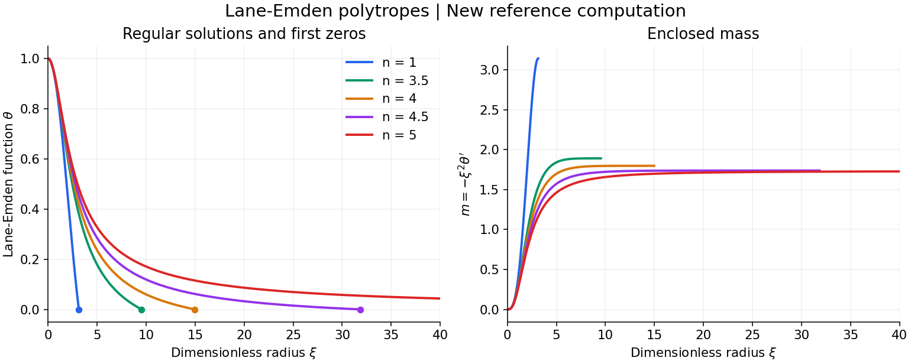
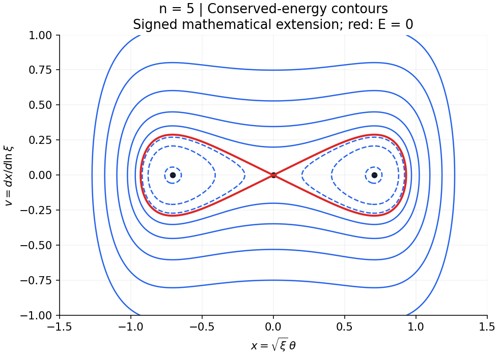

# Lane-Emden Polytropes

**Undergraduate research on stellar structure, nonlinear solution families, and mass-integral diagnostics.**

[Theory](docs/theory.md) · [My research contributions](docs/research-contributions.md) · [Reference implementation](docs/model.md) · [Report audit](docs/report-audit.md) · [Run and upload](docs/github-guide.md)

I carried out this project in my final undergraduate year with **Prof. Yu-Qing Lou, Department of Physics, Tsinghua University**. The work investigated the structure of self-gravitating polytropic spheres and the behavior of their nonlinear solution families. The surviving progress report credits **Yu-Qing Lou and Zi-Qi Xu** and documents studies at **n = 1, 3.5, 4, 4.5, and 5**.

This repository explains the physical theory, records the numerical research activities and original reported values, and preserves the source excerpt. It also includes a subsequently prepared Python reference implementation for revisiting the standard Lane-Emden model.

## Theoretical foundation

A spherical fluid in hydrostatic equilibrium satisfies

$$
\frac{dM}{dr}=4\pi r^2\rho,\qquad
\frac{dP}{dr}=-\frac{GM\rho}{r^2}.
$$

With the polytropic equation of state $P=K\rho^{1+1/n}$ and the dimensionless variables $\rho=\rho_c\theta^n$, $r=\alpha\xi$, these equations reduce to

$$
\boxed{\theta''+\frac{2}{\xi}\theta'+\theta^n=0.}
$$

For a regular center, $\theta(0)=1$ and $\theta'(0)=0$. The solution determines the radial density and pressure, and its derivative determines the enclosed mass. More general initial conditions generate additional mathematical branches whose physical interpretation requires separate examination.

The [theory document](docs/theory.md) develops the derivation, explains each variable, discusses stellar surfaces and singular boundaries, and connects phase-space analysis to the original research questions. The report's missing coordinate definitions are distinguished from the explicit notation used in this repository.

## My undergraduate research work

My work focused on numerical solution-family exploration and the interpretation of the resulting profiles in collaboration with Prof. Lou.

| Research activity | Documented work and outcome |
| --- | --- |
| Detailed investigation at n=4 | Compared phase portraits and radial profiles, classified labeled branches, and examined a branch discussed as a possible hollow configuration |
| Mass-integral hypothesis tests | Used ODE sampling and Simpson integration for two n=4 curves; compared step sizes from 1e-3 to 1e-5 |
| Noninteger-index comparison | Investigated behavior on either side of n=4, including displayed results at n=3.5 and n=4.5 and a reported 0.1-increment scan between 3 and 4 |
| Special phase structure at n=5 | Examined the double-lobed pattern and qualitatively classified loop-like trajectories |
| Oscillatory solutions at n=1 | Tested cancellation between selected regions using numerical integration and revised the proposed cancellation picture |
| Numerical and physical interpretation | Discussed solver efficiency, singular-point accuracy, pressure gradients, gravitational balance and the limitations of special-branch interpretations |

The [contribution document](docs/research-contributions.md) links each activity to specific pages, figures or sections of the surviving joint report. It describes participation in the collaborative work without assigning undocumented exclusive ownership of individual calculations.

## Original reported numerical results

| Calculation | Values reported in the historical excerpt | Interpretation |
| --- | --- | --- |
| n=4, two curve integrals | 0.0013 and 1.2853 at each of three step sizes: 0.001, 0.0001 and 0.00001 | Stable at the displayed precision; the values do not establish that both integrals vanish |
| n=1, first cancellation test | -3.1835 | The report concludes that the tested cancellation assumption does not hold |
| n=1, subsequent interval calculation | 6.3397 | Used in the report to discuss where a positive contribution could offset an earlier negative contribution |

These values come from the original report, not the new Python runs. Their complete integration bounds and normalization are absent from the excerpt. The hollow-region and neutrino interpretations remain historical hypotheses; the tangled n=3.5 plot alone does not establish chaos.

## New numerical illustrations



## Provenance and scope

| Material | Status |
| --- | --- |
| [Original PDF](reports/LEE_Progress_XvZiqi_0916.pdf) | Supplied historical excerpt: 3 PDF pages, printed pages 4–6; preserved byte for byte |
| Original MATLAB programs and raw data | Not supplied |
| Python package, tests, documentation, CSVs and figures | Newly created with AI assistance for this repository; not recovered undergraduate code |
| Original X, Y, w, z definitions and equations (1)–(2), (8) | Missing from the supplied excerpt |
| Historical figure/table reproduction | Not established; new figures use explicitly documented coordinates and initial conditions |
| Gravitational lensing calculation | Not present in the excerpt or implemented here; the excerpt's running title mentions lensing |

The MNRAS-style footer is manuscript formatting, not evidence of publication. No journal publication, DOI, exact historical code recovery, or experimentally confirmed hollow-star model is claimed.

## Research question

How does a self-gravitating polytropic fluid's radial structure depend on its equation of state, and what mathematical solution families appear as the polytropic index changes?

The standard dimensionless equation is

$$
\theta''+\frac{2}{\xi}\theta'+\theta^n=0,
\qquad \theta(0)=1,\quad\theta'(0)=0.
$$

On the ordinary physical branch, density is $\rho/\rho_c=\theta^n$ and the dimensionless enclosed mass is $m=-\xi^2\theta'$. The code stops at the first zero of $\theta$; a mathematical continuation beyond that surface is not automatically a physical stellar interior. The standard definitions and analytic benchmarks are described in [Vik Dhillon's stellar-structure notes](https://vikdhillon.staff.shef.ac.uk/teaching/phy213/phy213_le.html).

## Quick start

From the repository root, with Python 3.10 or newer:

```bash
python -m venv .venv
source .venv/bin/activate
python -m pip install -r requirements.txt
python -m unittest discover -s tests -v
python -m lane_emden
```

On Windows PowerShell, activate with `.venv\Scripts\Activate.ps1`. Use `python3` instead of `python` if required by your system. The repository runs directly from its root; `python -m pip install -e .` is optional for importing it elsewhere.

The final command regenerates the contents of `results/`. To preserve the bundled outputs while experimenting:

```bash
python -m lane_emden --output /tmp/polytrope-run
```

## What the implementation demonstrates

- Regular solutions for n = 1, 3.5, 4, 4.5 and 5, with center-series initialization and surface events.
- Agreement with independent analytic solutions at n = 0, 1 and 5.
- Enclosed mass computed independently from the derivative and Simpson quadrature, plus a quadrature-resolution study.
- A fully specified autonomous phase transformation for n > 1, including the conserved energy at n = 5.
- An explicitly labeled n = 1 signed mathematical continuation illustrating why oscillatory solutions require care in physical interpretation.



These contours are a **new mathematical illustration**, not a recreation of the report's Figure 10. Negative x is included only as an integer-power mathematical extension. The new positive-domain comparison is in [phase_fields.png](results/figures/phase_fields.png).

## Repository contents

| Path | Purpose |
| --- | --- |
| `lane_emden/model.py` | Radial solver, mass diagnostics, phase vector field and energy |
| `lane_emden/__main__.py` | One command to regenerate all numerical outputs and figures |
| `tests/test_model.py` | Analytic, surface, mass, domain and invariant checks |
| `reports/` | Unmodified source excerpt and provenance manifest |
| `data/historical/` | Values transcribed from the report, separate from new computations |
| `results/` | New CSV profiles, figures, convergence table and validation manifest |
| `docs/theory.md` | Physical assumptions, full Lane-Emden derivation, mass relation and interpretation |
| `docs/research-contributions.md` | Detailed account of the undergraduate research activities and reported outcomes |
| `docs/model.md` | New phase-coordinate derivation, conventions and numerical choices |
| `docs/report-audit.md` | Page-specific findings, unresolved definitions and scientific limitations |
| `docs/github-guide.md` | English running and upload instructions, with suggested repository metadata |
| `.github/workflows/check.yml` | GitHub Actions numerical checks |

## Validation

Run `python -m unittest discover -s tests -v`. The tests check analytic profiles and first zeros, independent mass quadrature, a transformed analytic n = 5 orbit, conservation of its phase energy, and rejection of unsupported negative fractional powers. Exact measured errors and the environment used to generate the included results are in [results/validation.json](results/validation.json).

The solver is DOP853 through SciPy, with relative tolerance 1e-10 and absolute tolerance 1e-12 for radial profiles. It is not an exact algorithmic replacement for MATLAB's ode45, ode89 or ode113. The phase portraits are qualitative field visualizations, not evidence of chaos or a convergence test.

## Open research tasks

1. Recover the full manuscript, especially the original coordinate transformations and branch definitions.
2. Recover the MATLAB `.m` files and exact initial/boundary conditions for the historical curves.
3. Revisit the singular-boundary term in the proposed zero-mass integral.
4. Determine how negative values were handled for noninteger indices.
5. Add lensing observables only after the relevant model assumptions and equations are available.

## Attribution and reuse

The historical excerpt credits Yu-Qing Lou and Zi-Qi Xu. This repository does not assign authorship of the new implementation to Prof. Lou. No blanket open-source license has been assigned to the report or repository; rights to the historical material are not established by the excerpt. See [PROVENANCE.md](PROVENANCE.md).
